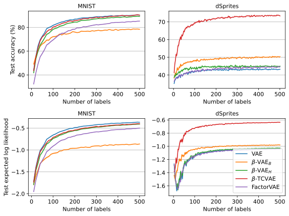

# VAE embeddings of MNIST and dSprites images

This repo contains code adapted from [`disentangling-vae`](https://github.com/YannDubs/disentangling-vae) for use in [`epig`](https://github.com/fbickfordsmith/epig)'s pipeline for semi-supervised Bayesian active learning.
It might also be useful elsewhere.


## Results

<div align="center">
	
</div>

Predictive performance of a linear classifier trained on an increasing number of labelled embeddings (class-balanced random samples).


## Getting set up

Clone the repo and move into it:

```bash
git clone https://github.com/fbickfordsmith/vae-embeddings.git && cd vae-embeddings
```

If you're not using a CUDA device, remove the `cudatoolkit` and `pytorch-cuda` dependencies in `environment.yaml`.

Create an environment using [Mamba](https://mamba.readthedocs.io) (or [Conda](https://conda.io), replacing `mamba` with `conda` below) and activate it:

```bash
mamba env create --file environment.yaml && mamba activate vae-embeddings
```


## Reproducing the results

Compute embeddings:

```bash
for dataset in mnist dsprites; do
    for encoder in vae betavaeb betavaeh betatcvae factorvae; do
        echo "Computing embeddings - ${dataset}, ${encoder}"
        python compute_embeddings.py --dataset ${dataset} --encoder ${encoder}
    done
done
```

Evaluate the embeddings in downstream classification:

```bash
for dataset in mnist dsprites; do
    for encoder in vae betavaeb betavaeh betatcvae factorvae; do
        echo "Evaluating embeddings - ${dataset}, ${encoder}"
        for seed in {0..19}; do
            python evaluate_embeddings.py --dataset ${dataset} --encoder ${encoder} --seed ${seed}
        done
    done
done
```

Plot the results:

```bash
python plot_results.py
```


## Citing this work

[`disentangling-vae`](https://github.com/YannDubs/disentangling-vae) repo:

```bibtex
@misc{dubois2019disentangling,
    author = {Dubois, Yann and Kastanos, Alexandros and Lines, Dave and Melman, Bart},
    year = {2019},
    title = {Disentangling {VAE}},
    howpublished = {https://github.com/yanndubs/disentangling-vae}},
}
```

This repo:

```bibtex
@article{bickfordsmith2024making,
    author = {{Bickford Smith}, Freddie and Foster, Adam and Rainforth, Tom},
    year = {2024},
    title = {Making better use of unlabelled data in {Bayesian} active learning},
    journal = {International Conference on Artificial Intelligence and Statistics},
}
```

([`src/`](/src/) in this repo is a lightly modified version of [`disvae/`](https://github.com/YannDubs/disentangling-vae/tree/master/disvae) in the original repo, and [`models/`](/models/) in this repo is a cut-down and rearranged version of [`results/`](https://github.com/YannDubs/disentangling-vae/tree/master/results) in the original repo.
The remainder of this repo is new.)


### Training methods

Standard VAE:

```bibtex
@article{kingma2014auto,
    author = {Kingma, Diederik and Welling, Max},
    year = {2014},
    title = {Auto-encoding variational {Bayes}},
    journal = {International Conference on Learning Representations},
}
```

```bibtex
@article{rezende2014stochastic,
    author = {Rezende, Danilo and Mohamed, Shakir and Wierstra, Daan},
    year = {2014},
    title = {Stochastic backpropagation and approximate inference in deep generative models},
    journal = {International Conference on Machine Learning},
}
```

β-VAE:

```bibtex
@article{burgess2017understanding,
    author = {Burgess, Christopher and Higgins, Irina and Pal, Arka and Matthey, Loic and Watters, Nick and Desjardins, Guillaume and Lerchner, Alexander},
    year = {2017},
    title = {Understanding disentangling in $\beta$-{VAE}},
    journal = {Workshop on ``Learning Disentangled Representations'', Conference on Neural Information Processing Systems},
}
```

```bibtex
@article{higgins2017beta,
    author = {Higgins, Irina and Matthey, Loic and Pal, Arka and Burgess, Christopher and Glorot, Xavier and Botvinick, Matthew and Mohamed, Shakir and Lerchner, Alexander},
    year = {2017},
    title = {$\beta$-{VAE}: learning basic visual concepts with a constrained variational framework},
    journal = {International Conference on Learning Representations},
}
```

β-TCVAE:

```bibtex
@article{chen2018isolating,
    author = {Chen, Ricky and Li, Xuechen and Grosse, Roger and Duvenaud, David},
    year = {2018},
    title = {Isolating sources of disentanglement in variational autoencoders},
    journal = {Conference on Neural Information Processing Systems},
}
```

FactorVAE:

```bibtex
@article{kim2018disentangling,
    author = {Kim, Hyunjik and Mnih, Andriy},
    year = {2018},
    title = {Disentangling by factorising},
    journal = {International Conference on Machine Learning},
}
```